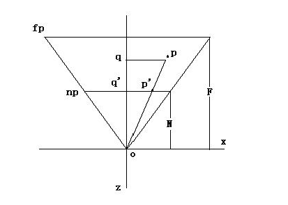
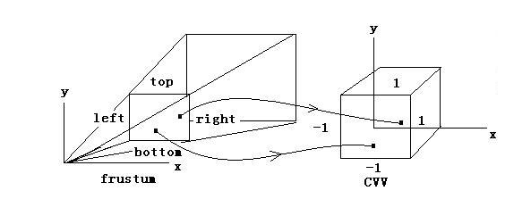
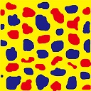
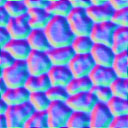

#软件光栅化器总结
新手任务做了一个软件光栅器，现总结流程。
## 模型视图矩阵
模型视图矩阵是为将模型转换至当前视点位原点，以指定的xAis、yAis、zAis为基向量的空间内。模型矩阵是单独针对模型本身的旋转平移等变换的矩阵，每个模型都不同。视图矩阵是将模型转换至视空间的变换矩阵。  
视图矩阵的推导：（View Transform）  
###### 移动camera， 使其位于world space的坐标原点
###### 旋转camera， 使其朝向z轴正方向，也就是视线由原点指向z轴正方向

一个camera一般有以下四个属性： 
 
*  向前向量（direction），相当于Z轴。
*  向上向量（up vector），相当于Y轴。
*  向右向量（right vector）， 相当于x轴
*  位置（position）

其中前三个向量是正交的，假设分别用d,u,v和p来表示四个变量。并假设待求的视图矩阵位V，根据前面的介绍我们知道，V的作用就是将相机移动到原点，并且将相机的三个向量分别于坐标轴对齐，d与z轴对齐，u与y轴对齐，r与x轴对齐。假设相机的与坐标轴对齐的矩阵位V，那么V的推导过程如下。

	rV = （1，0，0）；
	uV = （0，1，0）；
	dV = （0，0，1）；

假设矩阵V如下形式    

  
那么就有  
    
即  
  

设 

即 AB = I； 所以，又因为Ａ是正交矩阵，所以 即  
  
而将相机移动至原点的矩阵位  
  
所以    
  

根据指定的相机的位置（eye point），观察点（look at）和向上向量（up vector）。根据向量叉乘分别求出r，u，d。

**思考**：由于软件光栅器是模拟dx的，对于建立r，u，d时比较纠结是根据左手坐标系还是右手坐标系建立。后来仔细想了一下，其实都无所谓，这里只需要指定一个r、u、d的正方向，并且是正交的。真正的左手和右手是在透视投影的时候投射过去的。r的正向投射到了视锥体右侧，u的正向投射到了视锥体上侧，而z是设定了指向里面来计算。将乘过透视投影矩阵后，整个坐标系都是左手坐标系了。

## 透视投影矩阵

透视投影矩阵是将视空间内的物体透视投射到视锥体中的矩阵。推导过程如下：  
    
设p的坐标为（x,y,z）根据相似三角形可以求得的坐标为(Nx/z,Ny/z,N)。由于其z坐标没有意义，改造为(az + b) / N;所以   
其中 a = F/(F-N)  b= -NF/(F-N);  
现在需要将x和y分量变到[-1,1]的范围内，如下所示：  
    

使用线性插值，可得

	(Nx/z - left) / (right - left) = (Xcvv - (-1))/(1 - (-1)) ; 
	(Ny/z - bottom) / (top - bottom) = (Ycvv - (-1)) / (1 - (-1)); 
  

化简后为

	（Nx/z） / (right - left) - left / (right - left) = Xcc / 2 + 1 / 2;
	（Ny/z） / (top - bottom) - bottom / (top - bottom) = Ycc / 2 + 1 / 2;  
特殊情况，当投影平面在x方向上和在y方向上居中则上述公式可化简为

	(Nx/z)  / (right - left) = Xcc / 2;
	(Ny/z)  / (top - bottom) = Ycc / 2;	

所以  
	
  
    
  
所以反推出透视矩阵为  

   

一般情况的透视矩阵为：  
   

## 视锥体裁剪
裁剪是在顶点shader之后，坐标归一化之前。因为裁剪需要使用坐标的w信息，并且是在规范化立方体中进行裁剪 x=[-w,w], y=[-w,w], z=[0,w]体中。那么问题来了：
  
 **对于本该在视坐标系下与视锥体进行裁剪的过程，为什么能通过透视投影后的齐次坐标进行裁剪？**  
这里有一篇博客[齐次空间的裁剪](http://blog.csdn.net/softwarekid/article/details/45055253)。说的是经过透视投影变换后（x,y,w）仍然是线性的(可以对照上面的透视投影公式验证)。也就是说如果裁剪之前一条线段的为p1:(x1, w1) p2:(x2, w2); 线段上任意一点的坐标为 p1 * t + (1-t)*p2 为  

	x = t*x1 + (1-t)*x2;
	w = t*w1 + (1-t)*w2;

求其与x=-1的交点即 x = -w; 推出 t= (x2+w2) / (x2+w2-(x1+w1));最终也就求出了线段与原视锥体的交点。  
裁剪的流程使用三维区域码算法和Sutherland-Hodgman多边形裁剪算法裁剪就可以了。

## 三角形光栅化插值权重
三角形转换到屏幕空间进行光栅化时，需要计算三个顶点对像素的权重影响，这里使用Barycentric Coordinates,即重心坐标系插值算法。设三角形任意一点p，三角形三个顶点为p1,p2,p3.则p可以表示为 p = a * p1 + b * p2 + c *  p3; 这里 0=< a <= 1,  0=< b <= 1, 0=< c <= 1, 且 a + b + c = 1. 其中 a 为 点p到 p2p3 的距离 除以 点p1到p2p3的距离（有时间去证明）。 得到三个系数后就可以插值出光栅化像素的颜色、法线、纹理坐标等。  
其中距离可以直接将点坐标带入直线的一般式方程求取。

## 透视矫正
由于上述中的光栅化权重是在屏幕空间中求得的，由于透视投影的原因，屏幕空间中固定的步长所增加的xy偏移在视空间中是不对等的。[如文](http://blog.atelier39.org/cg/555.html)中所述。其实各个分量经过权重插值都有问题，但是UV坐标最为明显；[此文](http://www.360doc.com/content/14/0401/16/10724725_365488605.shtml)有更详细的解释。可以用如下公式进行透视矫正：

	int u, v;
	double zr = a*(1/p1w) + b*(1/p2w) + c*(1/p3w);
	u = ((a*(u1/p1w) + b*(u2/p2w) + c*(u3/p3w)) / zr) ;
	v = ((a*(v1/p1w) + b*(v2/p2w) + c*(v3/p3w)) / zr) ;

其中，p1w、p2w、p3w分别是三个顶点进行透视投影变换后[x,y,z,w]中的w值，u1、u2、u3和v1、v2、v3分别是三个顶点的原始uv坐标，a、b、c是使用Barycentric Coordinates算法计算出的三个系数。

## 切线空间与normal mapping
normal mapping是通过在纹理中包含法线信息，实现光滑物体表面光照明暗变化的过程。其中关键是求取切线空间，因为法线贴图是通过rgb通道包含法线信息，需要它随着模型旋转变换时，相对于模型表面的方向不发生变化。所以需要求取一组针对模型表面面片的基坐标。这就是切线空间。
### 求取切线空间
#### 三角面片的切线空间
设三角形三点为p0、p1、p2. 设向量Vec1= p0p1, Vec2 = p0p2; 设三点的uv坐标为(u0,v0)、(u1,v1)、(u2,v2);

	du1 = u1 - u0; 
	dv1 = v1 - v0;
	du2 = u2 - u0;
	dv2 = v2 - v0  

根据

  

推导出  

  

即  

  

所以：  

   
其中   
  

求出Tangent 和 Binormal，再根据向量的叉乘，求出三角形的法线Normal。

**注**：纹理坐标有可能出现非法数字的情况，这样就直接使用T= (1,0,0), B=(0,1,0);

#### 顶点的切线空间
由于渲染是对顶点的属性进行插值，所以要把面片的切线空间属性平滑至顶点上，也就是根据权重加和到三角形所包含的顶点上。 这个过程需要考虑几点：

* 三角形面积对切线空间加和权值的影响。
* 三角形当前顶点夹角的对权值的影响。
* UV拆点。
	* TBN对等(同为左手规则或者右手规则)（顶点和三角形）
	* TB方向不一致（顶点和三角形）
* 顶点Tangent和Binormal模为0

求出三角形TB，和三角形的面积mulArea，针对每个顶点求出三角形在此顶点的角度angel，对顶点的TB进行累加：

	Tv += T * mulArea * angel；
	Bv += B * mulArea * angle;

在累加的时候需要考虑当前顶点的切线空间是否需要拆点、一个顶点可以包含多个切线空间，三角形的索引中包含切线空间的索引，与顶点索引独立。

需要拆点的条件:

* 对等性：即是否都符合左手坐标系还是右手坐标系  
	
	inTangent,	inBinormal,	 inNormal   // 三角形的TBN
	refTangent, refBinormal, refNormal  // 遍历当前顶点的每组切线空间
	bool bParity = Cross(inTangent, inBinormal) * inNormal > 0;
	bool bParityRef = Cross(refTangent, refBinormal) * refNormal > 0;
	if (bParity != bParityRef){ // 说明不对等，判定下一组
		continue；
	}
	// 如果没有一组对等，就需要拆点了。向当前顶点的切线空间队列中添加一组新值。

* TB方向不一致：  
  不一致的衡量标准可以自己定，可以严格，也可以判定大概。下面是一种方法：  

	vrefTB = refTangent + refBinormal;
	vrefHalf = vrefTB - InNormal * Dot(vrefTB, inNormal); 
	// 其中的inNormal是三角形的normal
	if (Dot(inTangent + inBinormal, vrefHalf) < 0){ // 说明方向不一直
		continue；
	}
		
		
经过上述两个条件，没有寻找到合适的切线空间就只能向当前顶点的切线空间队列中添加一组新值。  

对所有的三角形处理完之后，就得到了所有顶点的切线空间（可能一对多），需要将其正交化。正交化的方法如下：  

	refNormal.normalize(); // 转换为单位向量
	refTangent = refTangent - refNormal * Dot(refTangent, refNormal);
	refTangent.normalize();
	refBinormal = refBinoraml - refNormal * Dot(refNormal, refBinormal) - refTagent * Dot(refTangent, refBinormal);
	refBinormal.normalize();

存储时为了减少存储量可以用tangent和normal来计算出Binormal，可以不用存储Binormal。  

	vef3 tmpBinormal = Cross(refTangent, refNormal);
	// 用tangent的w通道标记binormal的方向是和叉乘的方向相反还是相同
	if (Dot(tmpBinormal, refNormal) < 0){
		refTangent.w = -1;
	}
	else{
		refTangent.w = 1;
	}

上述通过加权求出的tagent和Binormal有可能模为0. 这种情况就根据法线构造出一组tangent和binormal。设法线向量为（x,y,z)，则构造的过程如下:

	float nx = abs(x), ny = abs(y), nz = abs(z);
	if (nx <= ny && nx <= nz){
		refTangent = (1,0,0);
		if (ny < nz){
			refBinormal = (0,1,0);
		}
		else{
			refBinormal = (0,0,1);
		}
	}
	else if(ny <= nx && ny <= nz){
		refTangent = (0,1,0);
		if (nx <= nz){
			refBinormal = (1,0,0);
		}
		else{
			refBinormal = (0,0,1);
		}
	}
	else if(nz <= nx && nz <= ny){
		refTangent = (0,0,1);
		if (nx <= ny){
			refBinormal = (1,0,0);
		}
		else{
			refBinormal = (0,1,0);
		}
	}

### 法线贴图

    
如上面两个图：左边为纹理贴图，右边为法线贴图。渲染时，在pixel shader中获取纹理贴图值和法线贴图值(只实现了线性sampler，使用双线性插值算法)。法线贴图获取的是rgb,范围是【0，1】。而需要转换一下：

	float t = rgb.r * 2 - 1.0;
	float b = rgb.g * 2 - 1.0;
	float n = rgb.b; // 因为面片表面的法线不应该指向面片内部，所以不能为负  

而传进shader的Tangent和Normal需要在vertex shader中求出binormal，并乘以相应的模型视图变换矩阵；

	vef3 binormal = Cross(tangent.xyz(), normal) * tangent.w;
	Cmatrix3x3 modeViewMatrix = (modelMatrix * viewMatrix).matrix3x3();
	Cmatrix3x3 tbn = CMatrix3x3(tangent, binormal, normal);
	tbn = tbn * modelViewMatrix;
	tangent = tbn.v(0);
	binromal = tbn.v(1);
	normal = tbn.v(2);  

将tbn传入pixel shader 与对应的t、b、n相乘，得到最终的法线，进行光照计算。

